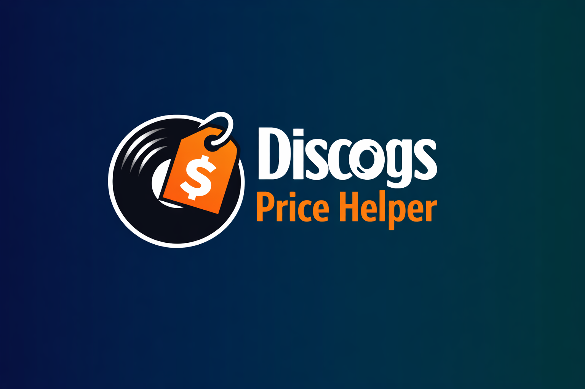
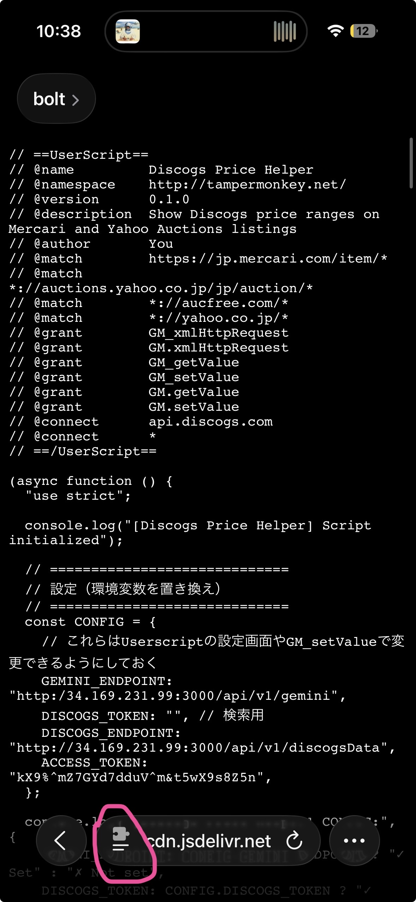
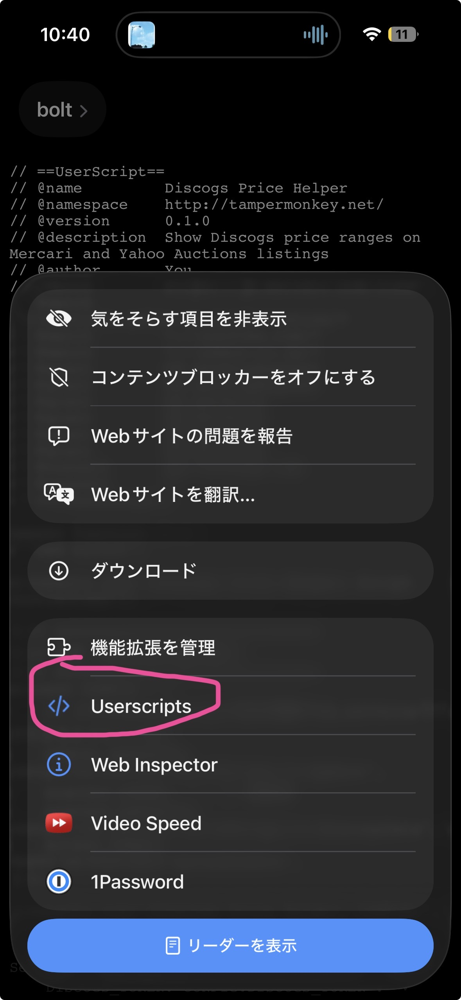
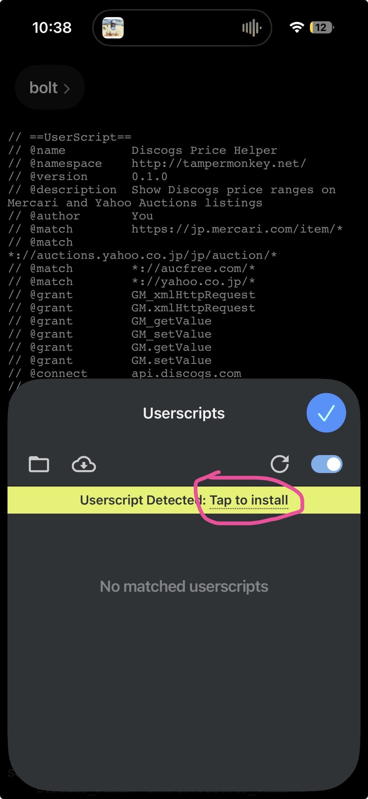
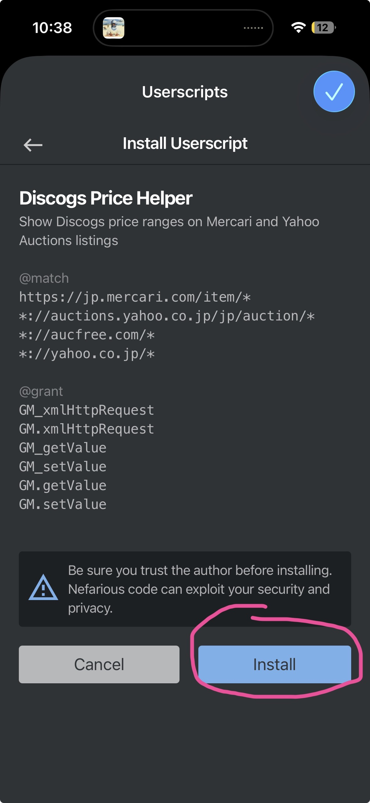

# Discogs Price Helper Extension

  

Discogsのマーケットプレイス価格（最低価格 / 中央価格 /
最高価格）を自動取得し、\
メルカリやオークションサイト閲覧時に参考価格として表示するツールです。

このツールは **Userscript** として動作します。\
そのためブラウザに「Userscriptマネージャー」を入れることで利用できます。

## Demo

---

# Features

- メルカリやオークション閲覧時に自動実行
- 商品タイトルを解析
- Discogs API から **Release ID** を取得
- Discogsマーケットページから価格取得
- 以下の価格を表示

項目 説明

---

Lowest Price 現在出品されている最低価格
Median Price 中央値
Highest Price 最高価格

---

# 対応サイト

Userscriptは以下のようなページ閲覧時に実行されます。

- メルカリ
- ヤフオク
- その他レコード販売サイト

ページタイトルからレコード情報を解析し、Discogs価格を取得します。

---

# 仕組み

1.  商品ページを開く
2.  ページタイトルを取得
3.  タイトルを整形（表記揺れ調整）
4.  Discogs APIでRelease ID検索
5.  マーケットページから価格取得

Discogsマーケットページ

    https://www.discogs.com/sell/release/{releaseId}

---

# Userscript Installation

このツールは **Userscript** として動作します。

Userscriptとは\
「Webページを自動で改造する小さなプログラム」です。

通常のアプリのようにインストールする必要はありません。

---

# iOS (iPhone / iPad) Safari セットアップ手順

ITに詳しくない方でも出来るように **一つずつ説明します。**

## 1 App Store を開く

iPhoneのホーム画面から

**App Store** を開いてください。

---

## 2 Userscripts アプリをインストール

検索で

    Userscripts

と入力します。

以下のアプリをインストールしてください。

**Userscripts (Safari拡張)**

---

## 3 Safari拡張機能を有効にする

インストール後、以下を行います。

1.  iPhoneの **設定アプリ** を開く\
2.  **Safari** をタップ\
3.  **拡張機能** をタップ\
4.  **Userscripts** をONにする

これでSafariでUserscriptが使えるようになります。

---

## 4 スクリプトを追加（CDN版）

以下の手順で CDN から直接 Userscript を追加します。

1. 本リポジトリの CDN URL をコピーします。
   https://cdn.jsdelivr.net/gh/benjaaamin0518/discogs-price-extension@2.2.1/discogs-userscript.user.js

2. Safariで上記のURLを開き、Safariの「パズルアイコン」を押下

  

3. Userscriptsを押下

  

4. 「Tap to install」を押下

  

5. 画面下の「install」を押下

  

6. これで iOS Safari で対象ページを開くと、自動で Discogs 価格が表示されます

---

## 5 Safariでサイトを開く

Safariで

- メルカリ
- ヤフオク

などのページを開きます。

レコード商品ページを開くと\
自動的に **Discogsの価格情報が表示**されます。

---

# 動作例

例

    商品ページ
    ↓
    タイトル解析
    ↓
    Discogs検索
    ↓
    Market価格取得
    ↓
    最低 / 中央 / 最高価格表示

---

# Known Limitations

- DiscogsのHTML変更で動作しなくなる可能性があります
- タイトルが特殊な場合、正しく検索できないことがあります

---

# Disclaimer

このツールは **Discogs公式とは無関係の非公式ツール**です。
